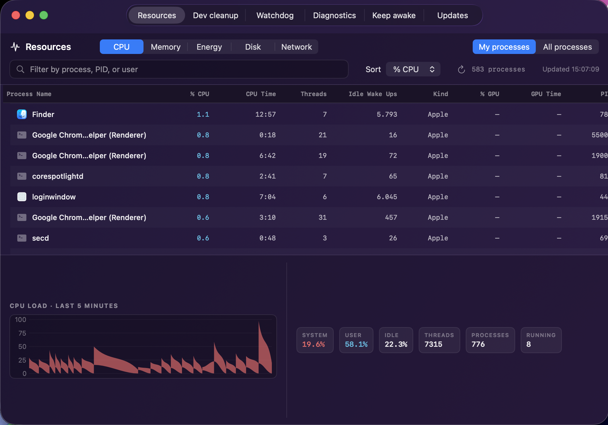

# KillSwitch

A macOS resource manager with automation useful for the AI era. It provides Activity Monitor-style system resources, guided disk cleanup, one-click process termination, developer cleanup, CPU alerts, active screen-time tracking, keep-awake controls, and native diagnostic collection.



## Features

- Activity Monitor-style CPU, memory, energy, disk, and network process views
- Defaults to the logged-in user's processes; switch to all processes to include root and other users
- Live five-minute graphs plus system-wide summary counters for every resource mode
- Low-overhead native CPU, memory, and disk sampling; heavyweight collectors run only for the selected metric
- Shows application icons and full executable names where macOS exposes them
- Filter by process, PID, or user and sort by the active resource
- One-click process termination (SIGTERM, falls back to SIGKILL)
- Guided disk cleanup for large files, temporary data, caches, and large folders
- Generates privileged 10-second spindump reports with preview, save, and reveal actions
- Runs full macOS `sysdiagnose` from the app or with **Shift-Command-D**
- Native macOS notifications when a process sustains high CPU for an extended period
- Tracks active screen time for the current day and continuous work stretch
- Optional native break reminders with a configurable 1–12 hour interval
- Menu bar (tray) icon — closing the window keeps the app running in the menu bar
- Keeps the Mac awake indefinitely or for a selected duration, with optional display sleep
- Advanced keep-awake settings for default duration, display sleep, and launch activation
- Runs at login via LaunchAgent
- Headless `killswitchctl` integration for syncing managed dev ports and invoking the same cleanup logic as the UI
- Dark, translucent UI inspired by Raycast

## Tabs

### Resources

One dense, live process table with five modes:

- **CPU** — % CPU, CPU time, threads, idle wakeups, architecture kind, PID, and user, plus a stacked user/system CPU graph.
- **Memory** — physical footprint, threads, open files, PID, and user, plus memory pressure, physical memory, app memory, cached files, wired memory, compression, and swap.
- **Energy** — current energy impact, rolling power history, sleep prevention, battery charge, and power-source status.
- **Disk** — per-process bytes read/written, free/occupied capacity, system operation totals, and live read/write throughput.
- **Network** — per-process bytes and packets sent/received, system totals, and live inbound/outbound throughput.

CPU, memory, disk, and network views sample every six seconds; Energy samples every
15 seconds because macOS requires a substantially heavier power collector. Sampling
continues while the main window is hidden so live data and history keep flowing.
**My processes** is the default scope; choose **All processes** to include system and
other-user processes. macOS can restrict disk, architecture, open-file, GPU, and App
Nap values for protected processes, so unavailable fields display an em dash instead
of fabricated data.

### Disk cleanup

- Opens on the **largest individual files first**, sorted by the disk space they
  currently use.
- Switch between **Largest files**, **Temporary**, **Caches**, and **Large folders**.
- Switching app tabs, cleanup categories, or browsed folders does not cancel
  scans already in progress. Completed locations remain cached, and **Rescan**
  keeps current rows visible while applying only added, updated, and removed items.
- Browse folder contents with breadcrumbs, filter by name or path, reveal any item
  in Finder, and select one or more cleanup candidates.
- Every cleanup requires confirmation and uses the macOS Trash; KillSwitch never
  permanently deletes an item.
- Standard home folders such as Documents, Downloads, Pictures, and Movies must be
  opened before their contents can be selected, preventing accidental removal of
  the whole anchor folder. `~/Library`, hidden home configuration, and the cleanup
  roots themselves are protected.
- iCloud-synced items are excluded because moving one to Trash can remove it from
  every synced device.
- macOS privacy controls can block Desktop, Documents, Downloads, and other
  locations. The tab reports partial scans and links to **Full Disk Access**
  settings. Replacing the standalone KillSwitch binary during an update can require
  granting access again.

### Dev cleanup

- Lists processes **listening on notable dev ports** (defaults: 3000–3003, 4000, 4200, 5000/5001, 5173/5174, 5555, 6006, 8000/8001, 8080/8081, 8090, 8443, 8888, 9000/9090/9091), showing PID, command, and port, each with a kill button.
- **Auto-kills** stale dev servers (node, python, java/mvn, rust/cargo, go, ruby, deno, bun, …) owned by the current user that have been running past the configured age (default **12 hours**).
- Never touches: processes owned by other users or the system, Copilot CLI / SDK, node-based MCP servers (github, context7, work_iq, fabric, seismic, azure, kusto, revenue, …), IDEs (VS Code, Obsidian, Chrome, Slack, Teams, OrbStack) or non-dev apps (Spotify, Handy, …). Detection is conservative — when in doubt it does **not** kill.
- Re-scans ports and re-runs cleanup on configurable intervals (defaults: every 5s / 10 min), plus a manual "Run cleanup now" button, and shows a summary of what was found and cleaned.
- **Fully configurable from the Settings card** — every detection input is exposed and editable, with changes persisted across launches:
  - Toggle **auto-kill** on/off and pick the **kill-after age** (1/6/12/24/48/72h).
  - Pick the **cleanup** and **port-scan** intervals.
  - Add/remove watched **ports**, dev **runtimes**, dev-server **indicators** (command-line signatures), and **protected** substrings (never killed).
  - **Reset to defaults** restores every value and clears synced integration ports
    until the integration syncs them again.


### CPU Watchdog

- Watches for processes (parent-collapsed) sustaining CPU above a threshold and fires **native macOS notifications** when one stays hot for several consecutive checks — mirroring the `cpu-watchdog.sh` / `cpu-hog-monitor.sh` shell scripts.
- Defaults: **90%** threshold, alert after **3** consecutive checks, every **5 min** (~15 min sustained). Threshold (80/85/90/95%), interval, and consecutive-check count are all configurable.
- After alerting, the per-process counter resets to avoid spam (it re-alerts after the same number of further consecutive sightings).
- Shows currently-offending processes with their consecutive count and a kill button, plus an in-app recent-alerts history.
- Appends to `~/Library/Logs/cpu-watchdog.log`, trimmed to the last 500 lines.

### Screen time

- Tracks active Mac use for the current day and the current continuous stretch.
- Counts only while keyboard or pointer input has occurred within the last **5 minutes**.
- Pauses counting after 5 minutes idle and ends the current stretch after **10 minutes** idle, screen lock, display sleep, system sleep, or a long monitoring gap.
- Optionally sends a native **Touch grass** break reminder every **1–12 active hours** (default interval: **2 hours** when enabled).
- Changing the interval schedules the next future boundary instead of immediately firing an overdue reminder.
- Persists today's total, current stretch, settings, and last reminder across launches. Daily totals reset at local midnight without ending an active stretch.
- Stores only aggregate durations on the Mac — no app, website, keystroke, or pointer history is collected.

### Diagnostics

- **Generate Spindump** samples user and kernel call stacks for 10 seconds, previews the report in-app, and supports Save/Reveal.
- **Run System Diagnostics** creates a full macOS `sysdiagnose` archive. Use the button, the menu-bar item, or **Shift-Command-D** while KillSwitch is active.
- macOS also provides the global sysdiagnose chord **Control-Option-Shift-Command-Period**.
- Reports are stored in `~/Downloads/KillSwitch Diagnostics/`; both actions request administrator authorization.
- See [docs/system-diagnostics.md](docs/system-diagnostics.md) for data sources, permissions, and limitations.

### Keep awake

- Start or stop a keep-awake session from the main window and see its active duration and mode.
- Choose the default duration used by the tab and optional launch activation.
- Keep the display on, or allow it to sleep while the Mac stays awake for background work.
- Optionally activate keep-awake automatically when KillSwitch launches. Preferences persist across launches.

### Updates

- Shows the running version and the latest published release, with a manual **Check for updates** button.
- Auto-checks on launch and on a configurable interval (**default every 1 hour**, selectable 15m–24h); when a newer build exists, a banner appears at the top of the window.
- **Update automatically** toggle: when enabled, new releases are downloaded and installed as soon as they're found, so you're always on the latest version with no action required.
- One-click **Download & install**: fetches the new binary, validates it, replaces the user-owned `~/bin/KillSwitch` (no admin prompt — the install path is in your home directory), reloads the LaunchAgent, and relaunches.
- **Uninstall KillSwitch** button: removes the binary and login LaunchAgent (same as `uninstall.sh`), then quits — no terminal needed.
- See [docs/auto-update.md](docs/auto-update.md) for the full release + update flow.

## Menu bar (tray)

KillSwitch lives in the macOS menu bar like Caffeine. A status item (⚡ icon) sits in
the top menu bar with a dropdown:

- **Keep Mac Awake** — prevents idle system sleep indefinitely, for 5/10/15/30
  minutes, or for 1/2/5 hours. It can also prevent display sleep when enabled in
  the **Keep awake** tab. The active duration is checkmarked; choose
  **Deactivate** to restore normal sleep behavior.
- **Show KillSwitch** — brings the window back to the front (restores the Dock icon).
- **Quit KillSwitch** — fully exits the app.

Closing the main window with the red close button does **not** quit the app — it hides
the window and drops the Dock icon, leaving only the menu bar icon. Re-open it from the
menu bar item (or by clicking the Dock icon if visible). To fully quit, use **Quit
KillSwitch** from the menu bar. CPU watchdog and screen-time monitoring continue while
the window is hidden, as does an active Resources sampler.

## Requirements

- macOS 13+ (Ventura or later)
- Swift 5.9+
- Xcode Command Line Tools
- An administrator account for spindump and sysdiagnose collection

## Install

One line — downloads the latest prebuilt release and sets it up to run at login
(no `sudo`, no source checkout needed):

```bash
curl -fsSL https://raw.githubusercontent.com/mbianchidev/kill-switch/main/install.sh | bash
```

This downloads the latest `KillSwitch` binary, verifies its SHA-256, installs it
to `~/bin/KillSwitch`, creates `~/bin/killswitchctl` as a symlink to that same
binary, and loads a LaunchAgent so the GUI starts at login. Re-running it upgrades
an existing install and refreshes the CLI symlink — handy if you're stuck on an
old build (see [Updating](#updating)).

### Build from source instead

From a checkout, `install.sh` builds with Swift automatically:

```bash
chmod +x install.sh uninstall.sh
./install.sh            # builds with Swift when run inside the repo
```

Force a mode with `KILLSWITCH_INSTALL_MODE=source` or `KILLSWITCH_INSTALL_MODE=release`.

This will:
1. Build (or download) the release binary
2. Copy it to `~/bin/KillSwitch` (no `sudo` required)
3. Link `~/bin/killswitchctl` to the same release binary
4. Install a LaunchAgent so the GUI starts at login

Ensure `~/bin` is on `PATH` before invoking `killswitchctl`.
Install, update, and uninstall refuse to replace or remove `~/bin/KillSwitch`
when it is a real directory. Existing binary files and symlinks are replaced or
removed safely. The `~/bin/killswitchctl` path is app-owned only when it is a
symlink; regular files and directories at that path are preserved.

## Headless CLI and Porto integration

The installed `killswitchctl` symlink runs the existing KillSwitch release binary
in headless mode. Basename dispatch happens before SwiftUI starts, so CLI
invocations never open the app window or menu bar item. Running the same binary as
`KillSwitch` preserves the existing GUI behavior.

```bash
killswitchctl dev-cleanup status --json
killswitchctl dev-cleanup sync-ports --source porto --ports 41000,41001 --json
killswitchctl dev-cleanup sync-ports --source porto --ports='' --json
killswitchctl dev-cleanup cleanup --json
```

`sync-ports` stores each integration's ports separately from the user-edited Dev
cleanup ports. Passing an empty value (`--ports=''` or `--ports=`) clears that
source. User ports are never overwritten; every UI scan and cleanup merges the
latest persisted integration ports, so a running app does not need to restart.

`status` and successful `sync-ports` calls return:

```json
{
  "autoKillEnabled": true,
  "effectivePorts": [3000, 41000, 41001],
  "integrationPorts": {
    "porto": [41000, 41001]
  },
  "userPorts": [3000],
  "version": "v1.2.3"
}
```

`autoKillEnabled` is the saved KillSwitch Dev cleanup mode, so integrations can
show whether a subsequent cleanup call is allowed to terminate candidates.

`cleanup` uses the same classification and termination service as **Run cleanup
now**, including the persisted auto-kill, age threshold, runtime, dev-indicator,
and exclusion settings:

```json
{
  "autoKillEnabled": true,
  "candidateCount": 2,
  "killedCount": 1,
  "killedProcesses": [
    {
      "ageHours": 13.5,
      "command": "/usr/local/bin/node vite --port 41000",
      "pid": 12345,
      "runtime": "node"
    }
  ],
  "version": "v1.2.3"
}
```

Invalid arguments exit `2`; runtime or persistence failures exit `1`. Errors are
JSON on stderr:

```json
{"error":{"code":"invalid_arguments","message":"..."}}
```

Porto can treat a missing `killswitchctl` as an optional integration, run the
official installer above, sync its current managed ports under source `porto`,
and invoke cleanup. Cleanup remains conservative: if auto-kill is disabled, or a
candidate has not crossed the saved age threshold, it is not terminated. Processes
that fail the saved runtime, indicator, ownership, system, or exclusion checks are
not candidates.

## Uninstall

From the app, open the **Updates** tab and click **Uninstall KillSwitch** (removes
the binary, `killswitchctl` symlink, and login LaunchAgent, then quits). Or from a terminal:

```bash
curl -fsSL https://raw.githubusercontent.com/mbianchidev/kill-switch/main/uninstall.sh | bash
# or, from a checkout:
./uninstall.sh
```

## Updating

Released builds update themselves: open the **Updates** tab (or wait for the
launch check) and click **Download & install** when a newer version is offered.
The updater overwrites whatever binary the LaunchAgent launches and refreshes the
`~/bin/killswitchctl` symlink, so the GUI and CLI always use the same release.

Every push to `main` is automatically published as a GitHub Release
(auto-incrementing semver, e.g. `v1.1.1`) with the compiled binary attached, and
the running app compares its embedded version against the latest release. See
[docs/auto-update.md](docs/auto-update.md) for details.

To update a source checkout manually instead:

```bash
./update.sh
```

## Run without installing

```bash
swift build -c release --product KillSwitch
.build/release/KillSwitch
```

To exercise the headless mode from a source checkout, invoke the binary through a
`killswitchctl` symlink; the executable basename selects CLI mode.

## Tech Stack

- Swift 5.9
- A shared `DevCleanupCore` target for preferences, integration-port merging, CLI parsing, and cleanup classification
- A shared `InstallCore` target for tested binary and symlink path safety
- A shared `ScreenTimeCore` target for tested active-time, idle-break, rollover, and reminder-boundary logic
- SwiftUI + Swift Charts (live resource graphs)
- AppKit (`NSWorkspace`) for application icons; `NSStatusItem` for the menu bar (tray) icon
- CoreGraphics idle-input timing plus `NSWorkspace` sleep, display, and session notifications for screen-time tracking
- Native macOS process and resource APIs (`libproc`, Mach CPU/VM statistics, IOKit), with `top`, `nettop`, `netstat`, and `pmset` activated only for metrics that require them
- `osascript` for native notifications, privileged diagnostics, and privileged self-update
- `URLSession` (async/await) + GitHub Releases API for in-app updates
- GitHub Actions for continuous releases on every push to `main`
- CodeQL static analysis (advanced setup, manual Swift build) — see
  [docs/ci-security.md](docs/ci-security.md)
- LaunchAgent for auto-start
